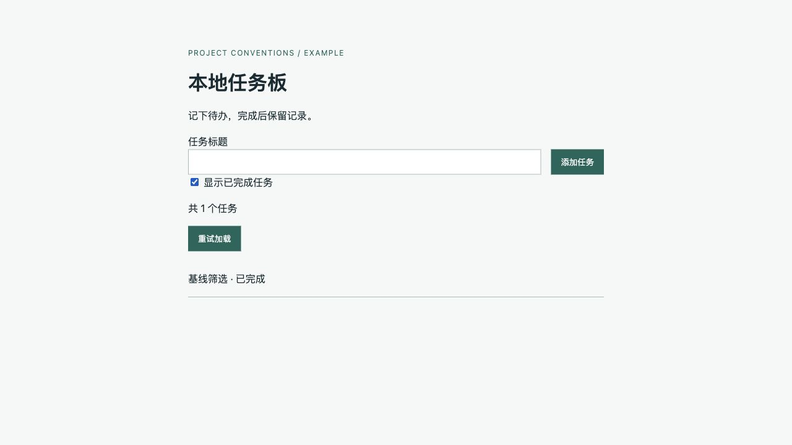

# 3.2.0 交付验证记录

日期：2026-10-07（Asia/Shanghai）。源码基于远端已交付的 `3da314d18bfbc27724683a95712ba56c5c149b4f` 继续；该提交包含最初指定的 `f2ed82a11647428c3ca97b0892147d48493c0e5f`。未操作其他工作区或业务工程。

## 生成与同步演练

同一代理现场演练，使用本轮填写的文稿对照完成；不是独立代理盲测。init/sync 是代理操作，本包没有独立生成 CLI。

临时目录起初只有 pyproject、CI、app、web、SQL、tests/build。运行证据采集并阅读配置与调用链后，依据模板填写入口、9 份适用规范、既有任务/新增列表筛选的需求与方案。包内 [教学项目](../assets/examples/task-board/) 保存填实结果，规范内容与项目事实、正反例和真实检查逐项核对。

模拟条件修订后实际差异：app/http.py、service.py、storage.py、web/api.mjs、page.mjs、index.html、tests/test_tasks.py，以及具体 list-filter 需求/方案。新增 status 三值，保留 include_done 原契约，拒绝非法/重复/混用输入；无新目录或 schema 变更。

[同步补丁](../assets/examples/task-board-sync.patch) 来自临时 Git 差异，已在另一份独立副本通过 apply --check、apply 和行为测试。根入口和 9 份通用规则同步前后 SHA-256 一致，证明这次功能条件变化没有改动写法标准；不代表模型以后一定作出相同判断。

## 实际检查结果

| 检查 | 结果与范围 |
|---|---|
| quick_validate.py | 通过；临时虚拟环境运行。最初解释器缺 PyYAML，安装到临时环境后重试，未改项目依赖 |
| 基线 `python3 -m unittest discover -s tests -v` | 10 项通过；首次从包根误运行导致 app 导入失败，改为教学项目根目录后通过 |
| 扩展条件同命令 | 12 项通过；默认/全部/仅已完成、旧参数兼容、非法/重复/混用与数据不变 |
| JS `node --check web/api.mjs` / `web/page.mjs` | 两版均通过；仅证明语法 |
| `python3 scripts/build.py` | 两版通过；Python 编译与静态复制，不是生产构建/发布 |
| 三个既有辅助脚本 | evidence、health、quality 的 --help 与 JSON 输出成功；sync 采集准确列出 9 个变化路径 |
| health/quality 结果 | 6 个启发式候选：复杂度 2、长行 3、覆盖率证据不足 1；仍需项目语义判断，未声称无缺陷/漏洞 |
| 相对引用/UTF-8/差异格式 | 本轮全部 Markdown 与图片引用可达，无替换字符；git diff --check 通过；指定内容排查无命中 |
| 六类基线规则兼容 | 32 个 ID 唯一，六份规则正文与 f2ed82a 按字节一致 |

自动检查环境：Python 3.14.7、Node 24.14.0、SQLite 3.53.4。浏览器首次服务命令解析到系统 Python 3.9，发现后停止并用明确的 Python 3.14 路径重启，复验列表与重试；基线 UI 使用 3.14。

## 真实 UI 检查

基线：空列表→创建→完成后默认隐藏→勾选后显示已完成。
扩展：创建/完成→待完成/全部/仅已完成；停止本机服务后请求失败、保留输入和条件、按钮恢复；重启后重试成功。390×844 和 1280×800 视口查看基本布局与主操作，键盘 Tab/Enter 提交成功并回到标题输入。仅为这些步骤的基础检查，未覆盖完整辅助技术或所有布局内容。

GitHub CI/Python 3.11、读屏、量化对比度、真实多进程并发、未知外部客户端、其他 AI 工具发现/加载、生产部署/数据恢复未验证；未操作发布后台。截图不是上述行为或环境的替代证据。

## 个人安装

同步前记录整个安装目录 87 个文件的 SHA-256，并核对同步开始前没有并发变化。受控清单 50 条路径：42 个文件写入，8 个旧示例规范/图片删除；同步后 92 个文件。50 个任务外文件哈希一致，三个独立修改脚本均未写入或删除。六类稳定基线正文也未改；安装不会升级业务工程。

| 保留脚本 | 同步前后相同的 SHA-256 |
|---|---|
| scripts/check_code_quality.py | `ed911d85c60b70982a2f3b3ec8c1d121e308b7e22c91915a52aba86975ad26b0` |
| scripts/check_project_health.py | `b8db597ddee482140a99735cae600fe28a3af68163e97b1886f5c30629f2b9d2` |
| scripts/check_dead_code.py | `ae3b719c9501967afb34e58359209495f8e8133104d1540435c8c79a991c1e35` |

同步前/后全量哈希、受控动作及旧文件备份保存在本机临时演练记录中；本报告保留关键结果与脚本哈希。每个同步文件与源码逐字一致，清单外文件逐一核对；源里没有的个人 dead code 脚本继续保留。

## sync 通用文件哈希证据

下列每项同步前后哈希相同；具体需求/方案与测试在补丁中有差异。

| 文件 | 同步前后相同的 SHA-256 |
|---|---|
| AGENTS.md | `907f29bb49f9233da87d1b6e1ed71bb79081b950580256f829b19ee0aadb4023` |
| docs/conventions/directory-structure.md | `b5fdd2b462a05d6cb7afb2fcebcc6e5895e347b8dc1bff035bc07cab48c619cf` |
| docs/conventions/python-standards.md | `ba4fd30d608d1f6159cefb2c6d8a911286692b261dcc2b67f315dc58e4e0dc2d` |
| docs/conventions/frontend-standards.md | `3bc01353afe5ff094cca6548de0c6cc45306ddb4c8dd3b2be2991b168a0c6115` |
| docs/conventions/javascript-standards.md | `99020a9fbfc23925cadf70da803c543c2c38d30473bd92a8ec31eda818f8961f` |
| docs/conventions/requirement-standards.md | `0b27d33c5e5de83ece599f362d9939b8962a52de1a58587b991bbcf2a564b56f` |
| docs/conventions/testing-standards.md | `ba534413eb8c470d60abf907e87fb7611431505532c28038c935740a504ccb60` |
| docs/conventions/technical-design-standards.md | `dbaf64c7e5ac3d6e355316794a332108dc8322cc7aa843c0ac8a51349c8990cf` |
| docs/conventions/ui-standards.md | `f0504d21b140bf0691e5578c3b1814654ecce963f7a04db757c016b9389c2bc3` |
| docs/conventions/database-standards.md | `3c4eca985a489f3d8d6c69d8c82ed42afc24597df120c4002d6f12ae39e54126` |
