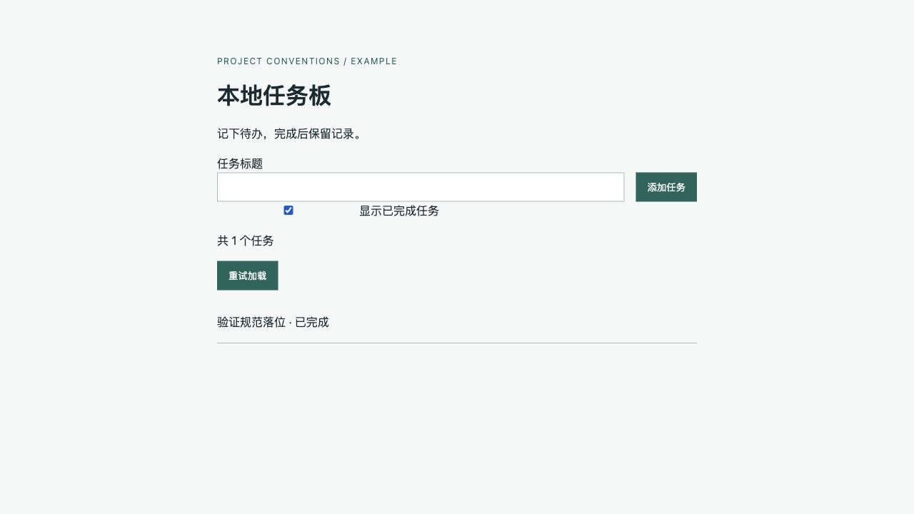

# 完整填实示例与演练

[task-board 示例目录](../assets/examples/task-board/) 是可运行的小型本地项目，包含原始配置/代码/测试，以及依这些事实填写的完整文档。它使用 Python 标准库、SQLite 和原生 JS，说明本技能不绑定 BOSS 示例的 Go/Kratos/GORM/Vue。实际 init 重新读取目标项目事实，不把此栈复制为默认。

## 完成后的文件

| 文件 | 已填内容 |
|---|---|
| [AGENTS.md](../assets/examples/task-board/AGENTS.md) | 全景、铁律、真实栈、概要树、命令/验证、条件读取；单服务的数据/外部依赖/任务说明 |
| [directory-structure.md](../assets/examples/task-board/docs/conventions/directory-structure.md) | 所有代码/配置/测试/迁移/文档/生成物归属、实际依赖方向、正反例/检查 |
| [language.md](../assets/examples/task-board/docs/conventions/language.md) | Python 与 JS 对应范围、输入/错误/资源/依赖、实际代码正反例与命令 |
| [frontend.md](../assets/examples/task-board/docs/conventions/frontend.md) | 页面与 API 模块边界、服务端事实、构建及语法检查 |
| [ui.md](../assets/examples/task-board/docs/conventions/ui.md) | 来自 tokens.css 的视觉值、页面状态、输入恢复、键盘/视口检查与限制 |
| [database.md](../assets/examples/task-board/docs/conventions/database.md) | 真实 tasks schema、参数绑定、事务、幂等、迁移与恢复范围 |
| [requirements.md](../assets/examples/task-board/docs/conventions/requirements.md) | 完整/简化/一句话加 AC 的写法、修订与检查 |
| [technical-design.md](../assets/examples/task-board/docs/conventions/technical-design.md) | 触发条件、八问、路径和失败契约的正反例 |
| [testing.md](../assets/examples/task-board/docs/conventions/testing.md) | unittest/JS/build 的实际配置、内存库隔离、结果与盲区 |
| [具体需求](../assets/examples/task-board/docs/requirements/tasks.md) / [具体方案](../assets/examples/task-board/docs/designs/tasks.md) | 任务创建/完成的 AC、各处实现、数据流、接口/错误、兼容、验证、恢复 |

每份规则都有适用范围、项目规则、正确/错误例和实际检查。单服务信息已在根入口，无需再造一份相同入口；多服务时采用 [服务模板](../assets/templates/service-instructions.md) 写子作用域增量。第二个 AI 工具接入时引用这个权威入口，避免复制全文。

## 怎么演练

把示例复制到临时目录，保留配置/源码/测试、移除入口和 docs；读取 pyproject、CI、app 调用链、web 与 SQL，再按模板填写上述适用文件。init 是代理执行这些动作的语义，没有 `init` 可执行文件。已填文档可用于对照完成结果。

本轮（2026-10-07）在独立临时目录完成了源文件核对、逐项填写和链接检查；基线 8 项 unittest、两模块 JS 语法、build 通过。浏览器完成空列表→创建→完成，以及停止服务后错误展示、输入保留、按钮恢复。只报告本机执行范围：Python 3.14.7、Node 24.14.0、SQLite 3.53.4；GitHub CI/Python 3.11、390 视口、键盘/读屏、对比度、生产部署未验证。

## 一次需求变化怎样 sync

模拟新要求：“默认隐藏已完成项，勾选后显示全部。”保留原 AC-T4-v1，并以 v2 替代默认行为，新增全部/非法参数 AC。读取调用方后改 http/service/storage 列表参数、web API/page/index，以及两个测试；先实现、验证，再同步具体需求/方案。

可复查 [完整变更补丁](../assets/examples/task-board-sync.patch)。在临时示例根执行 `git apply --check /path/to/task-board-sync.patch` 检查，确认后 `git apply`；这是教学演练补丁，不应用于真实业务仓库。补丁是本轮实际差异，可重放；不是新的生成 CLI。

| 候选影响 | 结论与依据 |
|---|---|
| 具体需求/方案 | 已更新：旧/新 AC、include_done 入出参/非法值、默认语义兼容变化、验证和代码恢复 |
| API/页面/测试源码 | 已更新：7 个代码/测试文件；10 项 unittest、JS/build 通过，浏览器默认隐藏与勾选显示通过 |
| 入口全景/架构/目录/命令 | 无须改：模块职责、路径、依赖、命令和技术栈不变 |
| 目录/语言/前端/UI 通用规则 | 无须改：新增筛选仍使用现有页面状态、API 和落位规则；具体文案/行为写在需求/方案 |
| 数据库规则/迁移 | 无须改：schema/事务不变，没有新迁移或索引证据 |
| 需求/方案/测试写法 | 无须改：AC 写法、八问、隔离方法和命令未变；只新增具体测试与实际结果 |
| 旧数据/未知外部客户端/发布 | schema 不变无需数据迁移；未知客户端/生产发布未验证，不声称默认语义向后兼容 |

这次演练证明文件填写、引用可达、代码/文档同步与本机检查的实际范围；不是独立代理行为评估，也不证明其他客户端加载成功。

同步后的当前视口实测截图（勾选显示已完成项）：

