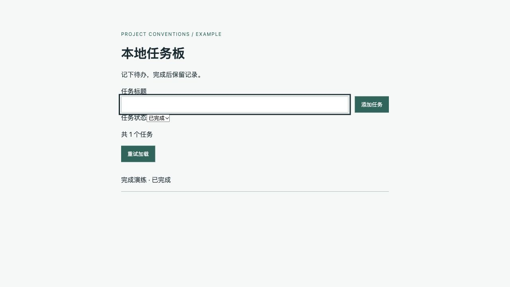

# 填实示例：新增列表筛选

[本地任务板](../assets/examples/task-board/) 是独立通用教学项目：Python 标准库、SQLite、原生 JS。配置、源码、测试与完整文档一同保存；init 必须重新读取目标项目，不能把示例栈、路径或业务选择当成默认事实。

## 生成后的适用文件

| 文件 | 填实内容 |
|---|---|
| [AGENTS.md](../assets/examples/task-board/AGENTS.md) | 定位/单服务关系、铁律、栈证据、概要树、真实命令、必须先读路由 |
| [directory-structure.md](../assets/examples/task-board/docs/conventions/directory-structure.md) | 真实树、接口/业务/数据/配置/测试/迁移/需求/方案归属、依赖方向和禁止位置 |
| [python-standards.md](../assets/examples/task-board/docs/conventions/python-standards.md) | app/tests/scripts 范围、业务输入、错误与连接所有权、标准库依赖、例子与检查 |
| [javascript-standards.md](../assets/examples/task-board/docs/conventions/javascript-standards.md) | web 范围、API/DOM 边界、用户文本、异步失败、例子与语法/行为区别 |
| [frontend-standards.md](../assets/examples/task-board/docs/conventions/frontend-standards.md) | API/页面组织、状态所有者、请求与构建边界 |
| [ui-standards.md](../assets/examples/task-board/docs/conventions/ui-standards.md) | 原生控件、tokens.css 真实 token、状态、布局、输入/键盘/焦点验收 |
| [database-standards.md](../assets/examples/task-board/docs/conventions/database-standards.md) | tasks 约束、参数绑定、索引依据、事务、迁移与恢复限制 |
| [requirement-standards.md](../assets/examples/task-board/docs/conventions/requirement-standards.md) | 大/中/小粒度、可观察 AC、关键歧义与修订写法 |
| [technical-design-standards.md](../assets/examples/task-board/docs/conventions/technical-design-standards.md) | 按影响选方案，回答八问，例子/反例与审查 |
| [testing-standards.md](../assets/examples/task-board/docs/conventions/testing-standards.md) | unittest、内存隔离、真实命令及四种证据边界 |
| [筛选需求](../assets/examples/task-board/docs/requirements/list-filter.md) / [筛选方案](../assets/examples/task-board/docs/designs/list-filter.md) | 这次功能的具体规则、验收、改动路径、契约与恢复 |

原有创建/完成需求和方案保存在 tasks.md。一个服务无需复制服务子入口；复杂多服务按 [服务模板](../assets/templates/service-instructions.md) 补局部增量。

## 从阅读到验收

任务是“新增列表筛选：默认未完成，勾选显示全部”。开工读入口，然后必须先读前端、UI、需求写法与测试规范；按真实影响再读目录、语言、数据库、方案写法与原任务需求。

先写 F1 默认未完成、F2 勾选全部、F3 非法参数拒绝且数据不变、F4 完成后刷新、F5 空/失败/保留条件与重试。此例教学需求已经给定这些业务选择；真实项目有关键歧义先澄清。

该功能跨页面、公共列表接口和查询，故用简化需求及独立短方案；仅本地文案改动可一句话加验收。方案逐项回答模块、各处改动、数据流、接口入出参、失败、兼容、验证、恢复。

实现沿目录：http 解析 include_done=0|1，service 传条件，storage 参数绑定；api 序列化、page 管理状态、HTML 加关联标签的 checkbox，tests 验证协议和数据。没有新目录、schema 或迁移。入口及规范的写法与职责保持原约定。

## init 现场演练

2026-10-07，本轮代理在临时目录只保留配置/源码/测试，入口与 docs 为空。运行证据采集并阅读 pyproject、CI、server/http/service/storage、SQL、web 和测试，按模板逐份填写演练稿，再写入上述文件。包内保存填实结果供审阅。

这是同一代理的现场演练，使用本轮已编写的文稿完成输出，属于有对照的验证；不是独立代理盲测，也不是包内 init CLI。核对产物范围、每份要求、引用、命令与代码依据后，基线 10 项 unittest、两模块 JS 语法与 build 通过。

## sync：后来改变筛选条件

教学新要求：“改为待完成、全部、已完成三种条件，默认仍待完成；旧 include_done 客户端继续有效。”

先读原需求/方案、代码、调用方与测试。扩展 status=active|all|done，空/非法/重复或和旧参数混用返回 400；旧参数仍返回原结果。将 checkbox 改为原生 select。具体需求关联 F1-v1/F2-v1 与新 v2，新增兼容与拒绝 AC；具体方案更新八问及实际结果，测试新增仅已完成、非法 status 和旧参数兼容。

[完整同步补丁](../assets/examples/task-board-sync.patch) 保存这次实际差异。仅在独立教学副本根目录执行：

```bash
git apply --check /path/to/task-board-sync.patch
git apply /path/to/task-board-sync.patch
python3 -m unittest discover -s tests -v
node --check web/api.mjs
node --check web/page.mjs
python3 scripts/build.py
```

| 候选影响 | 实际结论 |
|---|---|
| 具体需求/方案 | 已更新：条件、旧/新 AC、接口、失败、兼容和恢复 |
| HTTP/service/storage/API/页面/HTML/测试 | 已更新：7 个文件；补丁可重放，12 项 unittest 与 JS/build 通过 |
| 根入口/目录/9 份通用规范 | 不适用：职责、路径、依赖、栈、命令和通用写法未变；10 个文件哈希完全一致 |
| 数据库迁移/索引 | 不适用：schema 不变，无新查询规模证据；不凭空加迁移或索引 |
| 未知客户端/生产部署/数据恢复 | 未验证：测试只覆盖本仓调用方与本机环境 |

一项功能条件变化更新具体需求、方案与测试，只有通用写法变化才改规范。若后来增加独立查询模块，则需同步目录归属、入口概要、相关方案与实际检查；简单筛选不建立地图/账本。

本机 Python 3.14.7、Node 24.14.0、SQLite 3.53.4；浏览器验证基线二选一与扩展三条件、完成后刷新、停止服务后的错误/输入/条件保留/按钮恢复、重启后重试。实际范围及哈希证据见 [验证记录](../docs/conventions-validation.md)。GitHub CI/Python 3.11、其他 AI 客户端真实加载、读屏/对比度/生产环境保持未验证。


